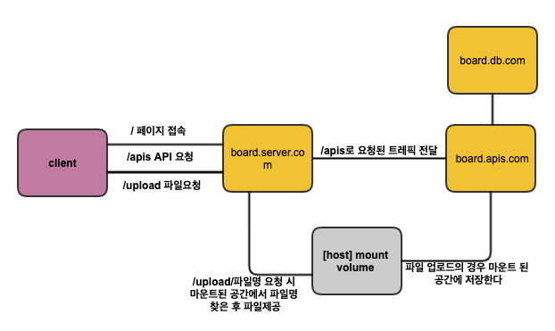

# Tech Stacks

```
서버: nest.js
디비: mysql, typeorm
배포: docker, nginx

프론트: react.js
디자인: styled-components, storybook
```

# Architecture



배포에 대한 생각

프로덕션 모드에선 API 서버의 직접 접속을 허용하지 않는다.

실제 환경이라면 API 서버는 board.server.com의 역할을 하는 웹서버 접속만 허용한다.

파일의 경우 서버 트레픽 집중을 방지하기 위해 웹 서버에서 서빙하는 역할을 부여한다.

개발모드에선 웹서버를 앞단에 두기엔 점검 포인트가 증가하므로 API 서버에 직접 접근을 허용한다.

# 배포

## production

* up

```
$ chmod 755 deploy.sh

$ ./deploy.sh
```

* down

```
$ docker-compose down
```

http://localhost/board

swagger => http://localhost/api

production의 경우 서버 API의 endpoint는 API 요청과 File 접근 시 각각 /apis, /upload을 prefix 해야한다.

# 로컬 테스트

* 디비

```
$ docker run -d -p 3306:3306 -e MYSQL_ROOT_PASSWORD=password --name board.db.com mysql:5.7

$ docker exec -it board.db.com mysql -u root -ppassword -e "CREATE DATABASE Boards;"
```

데이터베이스 생성 명령어에서 다음과 같은 경고문구가 출력될 수 있음.

```
mysql: [Warning] Using a password on the command line interface can be insecure.
```

* 서버

```
$ cd server 
$ npm run start:dev
```

서버/api 접속할 경우 swagger 접속가능

* 웹

```
$ cd client 
$ npm run start
```

---

디자인은 귀찮아서 도저히 못하겠다 ㅋㅋ